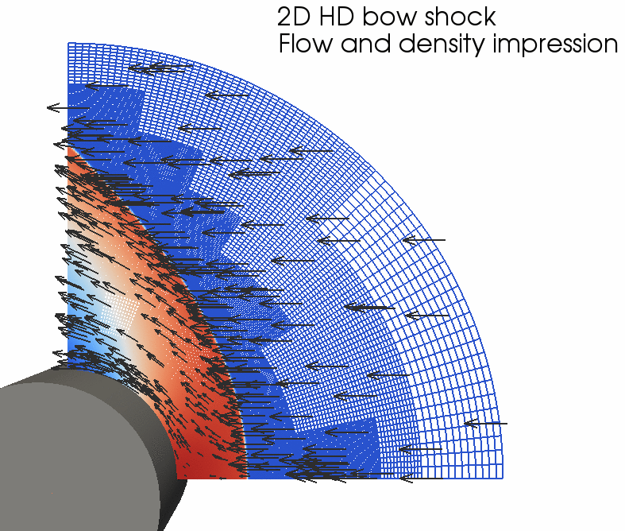
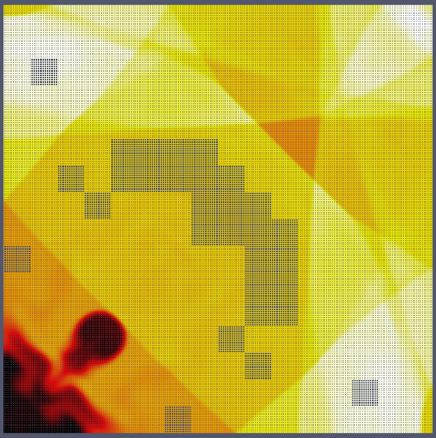
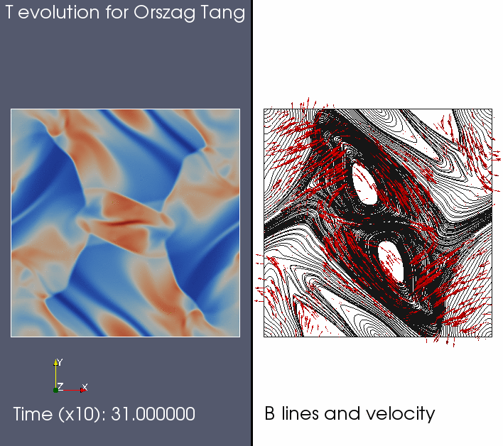
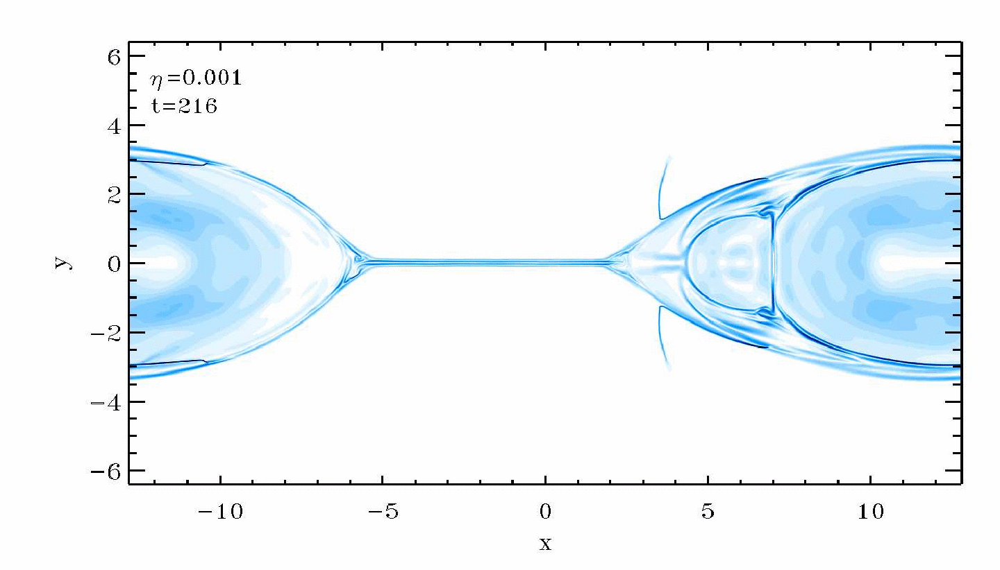

# Example simulations

This document describes a few relatively simple example simulations which can
be done based on some readily available tests in amrvac/tests/
See [usage](usage.md) for a more complete description on how to use the code.

## Advection tests

Configure MPI-AMRVAC to the standard 2D [advection equation](@ref eq_rho) test
as follows:
    cd amrvac/tests/rho/vac
    setup.pl -d=2
    make
    mpirun -np 2 amrvac

This test contains several tests, distinguished by **iprob**. In the above setting, it
will use **iprob=3** as specified in the [amrlist](@ref par_amrlist) and
do a 2D advection of the VAC-logo on a double periodic domain, on the unit
square. After [converting](convert.md) the 21 data files created to the VTK
format suited for paraview visualization, you will be able to make the
following movie in a few simple steps:

Its default settings is to perform one advection over the full diagonal, use 3
AMR levels, and have a base level 1 resolution of 50 by 50 (split in 10
by 10 grid blocks). A somewhat more advanced paraview user can make the
following movie, combining the 2D view with a cut along the middle of the box:

A 3D variant is to do the advection of a sphere along the diagonal of a cube.
This is selected by (iprob=6 in the amrvac.par file)

    cd amrvac/tests/rho/auto_3d
    setup.pl -d=3
    make
    mpirun -np 2 amrvac

Use now the data conversion and paraview to make the following movie:

A second, 2D test runs **iprob=1** by doing

    cd amrvac/tests/hd/Kelvin_Helmholtz_2D
    setup.pl -d=2
    make
    mpirun -np 2 amrvac

It sets up a sheared horizontal velocity field (a _tanh_ profile), augmented
with a small sinusoidal vertical displacement centered on the velocity shear
region. This situation is Kelvin-Helmholtz unstable, and a vortical flow
pattern develops. After converting and using paraview, you can create frames
as shown below.

 

## HD tests

The examples realizing relatively standard test cases
for [hydrodynamics](@ref eq_hd) include

    amrvac/tests/hd/Woodward_Collela_2D
    amrvac/tests/hd/bow_cylindrical_2D
    amrvac/tests/hd/Rayleigh_Taylor_2D
    amrvac/tests/hd/Richtmyer_Meshkov_dust_2D
    amrvac/tests/hd/Riemann_pole_2D
    amrvac/tests/hd/liska_2D

The first one listed is the Woodward and Collela shock reflection problem, on a 2D
cartesian grid. It is a nice illustration on how to code up some non-trivial
special boundary conditions (spatio-temporally varying). The second is a
supersonic flow hitting a cylinder, and demonstrates the use of a cylindrical
grid. The third uses an external constant
gravitational field to simulate the development of a Rayleigh-Taylor
instability when a heavy density gas rests on top of a light one. The fourth
test concentrates on the Richtmyer-Meshkov variant of the Rayleigh-Taylor
instability, by letting a shock impinge on an inclined density discontinuity.
The fifth test does a standard 1D Riemann problem (the Sod problem) on a 2D
polar grid, to show how the boundary conditions need to be set for a symmetry
axis. The final test could be run in 2D and 3D, and studies the multiple
reflection of shocks in a box, where one can vary the schemes at will, to see
how the small-scale structure (combinations of Richtmeyer-Meshkov and Kelvin-
Helmholtz behaviour) are influenced by resolution, discretization etc. It is
also useful to see which schemes maintain the symmetry about the diagonal.

Impressions for some of these tests are shown below:

 

This Rayleigh Taylor test (july 2011) can be repeated with 7 refinement
levels, it then takes 11375 seconds (on a 4 CPU macBook pro, a bit over 3
hours, all IO included). The movie and figure for that run is 

The latter 'liska' test is a nice one to test symmetry-preserving properties
for schemes, and to compare effects of resolution (by raising the number of
AMR levels). On my MacBook Pro (june 2011), a quadcore CPU with 8GB memory, I
can run a 6 level version (base resolution 24 x 24) up to time t=2.5 in less
than 12000 seconds (slightly over 3 hours). The movie for that run is [shown
here](figmovdir/liska.avi).

## MHD tests

The amrvac/tests/mhd codes up a large variety of standard test
cases for [MHD](@ref eq_mhd), going from 1D Riemann problems to tests
doable in 2D and 3D. 

One of the tests is the Orszag-Tang test, in the compressible regime, for
which an animation is shown below.

The Orsaz-Tang test is again nice to test symmetry-preserving properties for
schemes, and to compare effects of resolution (by raising the number of AMR
levels). 

Another representative MHD problem is the GEM challenge, realizing
reconnection in resistive MHD. The problem is described e.g. in the book
'Advanced Magnetohydrodynamics. With applications to laboratory and
astrophysical plasmas.', J.P. (Hans) Goedbloed, Rony Keppens, &amp; Stefaan
Poedts, 2010, Cambridge University Press, 634 pages, [ISBN 9780521705240
(Paperback)](http://www.cambridge.org/uk/catalogue/catalogue.asp?isbn=9780521705240).
We show here the case with resistivity parameter set to 0.001.

